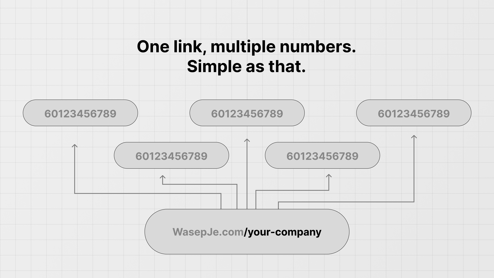

 
 

<h3 align="center">WasepJe.com</h3>

Open-source WhatsApp Link Rotator, a wasap.my alternative.

## Tech Stack

This is a [T3 Stack](https://create.t3.gg/) project bootstrapped with `create-t3-app`.

- [Next.js](https://nextjs.org)
- [Clerk](https://clerk.com)
- [Prisma](https://prisma.io)
- [Tailwind CSS](https://tailwindcss.com)
- [tRPC](https://trpc.io)
- [shadcn/ui](https://ui.shadcn.com)
- [Supabase](https://supabase.com)

## Before running the project

1. You need these 3 environment variable, see `.env.example`.

   - `DATABASE_URL`
   - `NEXT_PUBLIC_CLERK_PUBLISHABLE_KEY`
   - `CLERK_SECRET_KEY`

2. Create a PostgreSQL database and get the database URL (this project use Supabase).
3. Create a Clerk account, setup a project, and get the `NEXT_PUBLIC_CLERK_PUBLISHABLE_KEY` and `CLERK_SECRET_KEY`.
4. Create a `.env` file and add all the required variable.

## Starting the app

1. Fork and clone the repo locally.
2. Make sure all the required environment variable is added in `.env` file.
3. Install dependencies with [bun](https://bun.sh).
4. Run `bunx prisma db push` to setup the database.
5. Run `bun dev` to start the app on `localhost:3000`

## Banning a user and thier links.

1. Add Clerk `userId` to middleware.
2. Add `{ "banned" : true }` to user public metadata.
3. Update `banned` to `true` for all links by the user.
